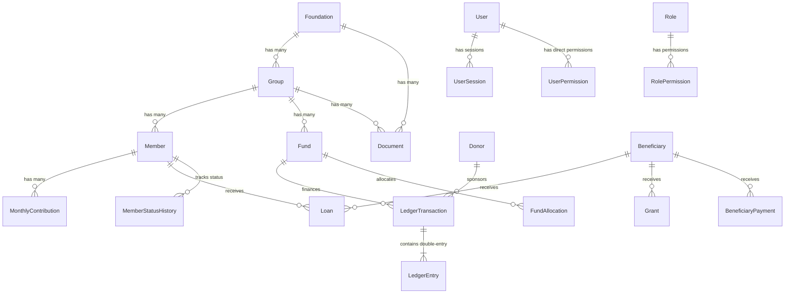

# PostgreSQL Database & Prisma Schema Audit Report

**Date of Audit:** 2026-08-14  
**Audit Mode:** Strictly Read-Only / Introspection  
**Target Database:** Neon PostgreSQL 18.4 (`neondb`) via SSL Pooler  
**Frontend ORM Reference:** Prisma ORM 6.19.3 (31 models)  

---

## 1. Existing PostgreSQL Schema (Live Database State)

Introspection was conducted against the target Neon PostgreSQL database cluster:

- **Cluster Version:** `PostgreSQL 18.4 (c9a59a4) on aarch64-unknown-linux-gnu`
- **Active Schemas:** `public`, `information_schema`, `pg_catalog`, `pg_toast`
- **Live Tables in `public`:** `0` tables
- **Custom Enum Types:** `0` types
- **Active Sequences:** `0` sequences
- **Existing User Data:** None (Empty, uninitialized PostgreSQL instance provided as target)

---

## 2. Prisma Schema Representation & Target Entities

The existing application data model is defined in [`frontend/prisma/schema.prisma`](file:///workspaces/foundation-backend-migration/frontend/prisma/schema.prisma), comprising **31 core models**:

### Entity Categorization & Relationships

### Complete Target Models Inventory

| # | Entity / Model | Core Fields & Responsibilities | Key Relations & Foreign Keys |
| :--- | :--- | :--- | :--- |
| 1 | **Foundation** | `id`, `name`, `description`, timestamps, audit fields | Groups, Documents |
| 2 | **Group** | `id`, `foundationId`, `name`, `code` (unique), `status`, `isFoundationGroup`, `memberSignupEnabled` | Foundation (FK), Members, Funds, Documents |
| 3 | **Member** | `id`, `memberId` (unique), `groupId`, `fullName`, `mobile`, `nationalId`, `status`, `memberType`, demographic details | Group (FK), MonthlyContributions, Loans, Requests, StatusHistory |
| 4 | **Beneficiary** | `id`, `beneficiaryId` (unique), `fullName`, `mobile`, `nationalId`, `assistanceType`, `loanAmount` | Member (optional FK), Grants, Loans, BeneficiaryPayments |
| 5 | **Donor** | `id`, `donorId` (unique), `fullName`, `donorType`, `email`, `phone`, `status` | LedgerTransactions, CampaignContributions |
| 6 | **Fund** | `id`, `groupId`, `name`, `code`, `currentBalance`, `targetAmount`, `status` | Group (FK), LedgerTransactions, Allocations |
| 7 | **MonthlyContribution** | `id`, `memberId`, `month`, `year`, `baseAmount`, `dueAmount`, `status` | Member (FK), ContributionPayments |
| 8 | **ContributionPayment** | `id`, `contributionId`, `amount`, `paymentDate`, `paymentMethod`, `receiptNo` | MonthlyContribution (FK) |
| 9 | **LedgerTransaction** | `id`, `transactionId` (unique), `transactionDate`, `type`, `description`, `fundId`, `amount`, `status` | Fund (FK), Member (FK), Donor (FK), LedgerEntries |
| 10 | **LedgerEntry** | `id`, `transactionId`, `accountType`, `entryType` (DEBIT/CREDIT), `amount` | LedgerTransaction (FK, cascade delete) |
| 11 | **Loan** (Qard Hasan) | `id`, `loanId` (unique), `borrowerType`, `memberId`, `beneficiaryId`, `principalAmount`, `totalRepaid`, `status` | Member (optional FK), Beneficiary (optional FK), LoanRepayments |
| 12 | **LoanRepayment** | `id`, `loanId`, `installmentNumber`, `amount`, `paymentDate`, `status` | Loan (FK, cascade delete) |
| 13 | **Grant** | `id`, `grantId` (unique), `beneficiaryId`, `fundId`, `amount`, `disbursementDate`, `purpose`, `status` | Beneficiary (FK), Fund (FK) |
| 14 | **FundAllocation** | `id`, `sourceFundId`, `targetFundId`, `amount`, `allocationDate`, `remarks` | SourceFund (FK), TargetFund (FK) |
| 15 | **DocumentCategory** | `id`, `name`, `code` (unique), `description`, `status` | Documents |
| 16 | **Document** | `id`, `title`, `fileUrl`, `fileType`, `fileSize`, `foundationId`, `groupId`, `memberId`, `categoryId` | Foundation, Group, Member, Category |
| 17 | **Campaign** | `id`, `name`, `code` (unique), `targetAmount`, `raisedAmount`, `startDate`, `endDate`, `status` | CampaignContributions, BeneficiaryPayments |
| 18 | **CampaignContribution** | `id`, `campaignId`, `donorId`, `amount`, `paymentDate`, `receiptNo` | Campaign (FK), Donor (optional FK) |
| 19 | **BeneficiaryPayment** | `id`, `campaignId`, `beneficiaryId`, `amount`, `disbursementDate`, `purpose` | Campaign (FK), Beneficiary (FK) |
| 20 | **User** | `id`, `username` (unique), `email` (unique), `passwordHash`, `roleId`, `status`, `lastLoginAt` | Role (FK), Sessions, UserPermissions |
| 21 | **UserSession** | `id`, `userId`, `sessionToken` (unique), `ipAddress`, `userAgent`, `expiresAt` | User (FK, cascade delete) |
| 22 | **Role** | `id`, `name` (unique), `displayName`, `description`, `isSystemRole` | RolePermissions, Users |
| 23 | **Permission** | `id`, `module`, `action`, `code` (unique), `description` | RolePermissions, UserPermissions |
| 24 | **RolePermission** | `id`, `roleId`, `permissionId` | Role (FK, cascade), Permission (FK, cascade) |
| 25 | **UserPermission** | `id`, `userId`, `permissionId`, `isGranted` | User (FK, cascade), Permission (FK, cascade) |
| 26 | **AuditLog** | `id`, `userId`, `action`, `resource`, `resourceId`, `oldValues` (JSON), `newValues` (JSON), `ipAddress` | User (optional FK) |
| 27 | **MemberRequest** | `id`, `trackingNumber` (unique), `groupId`, `fullName`, `mobile`, `status`, `rejectionReason` | Group (FK), Reviewer User (FK) |
| 28 | **MemberStatusHistory** | `id`, `memberId`, `previousStatus`, `newStatus`, `reason`, `changedById` | Member (FK), ChangedBy User (FK) |
| 29 | **Settings** | `id`, `category`, `key` (unique per category), `value` (JSON), `description` | - |
| 30 | **SystemSettings** | `id`, `siteName`, `logoUrl`, `fiscalYearStart`, `currencyCode`, `features` (JSON) | - |
| 31 | **FoundationProfile** | `id`, `foundationName`, `registrationNumber`, `contactEmail`, `contactPhone`, `address` | - |

---

## 3. Differences Found

1. **Target Database Population:**
   - The PostgreSQL instance currently contains `0` tables, whereas the frontend previously connected to Turso/SQLite.
   - All 31 entity schemas need to be mapped into SQLAlchemy 2.0 ORM Declarative models and created via an initial Alembic baseline migration in the next phase.

2. **Data Types (SQLite/Turso vs. PostgreSQL):**
   - **Timestamps:** SQLite stored timestamps as ISO strings or integers. PostgreSQL uses native `TIMESTAMPTZ` (`TIMESTAMP WITH TIME ZONE`).
   - **Booleans:** SQLite used integer representations (`0`/`1`). PostgreSQL uses native `BOOLEAN` (`true`/`false`).
   - **JSON:** SQLite stored structured config/audit objects as `TEXT`. PostgreSQL provides native `JSONB` with indexability.
   - **Financial Precision:** In SQLite, numerical values were stored as `INTEGER` (minor units) or `REAL`. In PostgreSQL, critical financial amounts (`LedgerEntry.amount`, `Loan.principalAmount`, `Fund.currentBalance`) should use `NUMERIC(15, 2)` or `BIGINT` to prevent precision loss.

3. **Constraints & Foreign Keys:**
   - In SQLite, foreign keys were sometimes relaxed or required explicit `PRAGMA foreign_keys = ON;`. In PostgreSQL, foreign keys and cascading rules (`ON DELETE RESTRICT`, `ON DELETE CASCADE`) are strictly enforced at the engine level.

---

## 4. Potential Migration Risks & Mitigations

| Risk | Impact | Mitigation Strategy |
| :--- | :--- | :--- |
| **UUID vs String ID Compatibility** | Next.js frontend sends/expects 36-character UUID strings (e.g. `crypto.randomUUID()`). | Use `String(36)` or `UUID(as_uuid=False)` in SQLAlchemy models so string UUIDs serialize seamlessly without type conversion errors. |
| **Double-Entry Ledger Invariance** | Financial integrity depends on debits strictly equaling credits for every ledger transaction. | Enforce database-level check constraints and application-level transaction atomicity (`db.begin()` / ACID rollback). |
| **Case-Sensitivity & Collation** | PostgreSQL text searches are case-sensitive by default (`ILIKE` vs `LIKE`). | Use SQLAlchemy `func.lower()` or PostgreSQL `CITEXT` / `ILIKE` for case-insensitive member and user lookups. |
| **Connection Pooling with Serverless Neon** | Serverless PostgreSQL connections can drop if idle or scaled down. | SQLAlchemy engine configured with `pool_pre_ping=True`, `pool_recycle=300`, and `pool_size=5` with connection timeout resilience. |

---

## 5. Recommended Approach for Future Phases

1. **Phase 3 — Database Schema & Alembic Baseline:**
   - Define exact SQLAlchemy 2.0 Declarative Models in `backend/app/models/` for all 31 entities.
   - Generate a single, clean baseline Alembic migration script (`alembic/versions/001_initial_schema.py`).
   - Apply the migration to the PostgreSQL database to establish the schema with full foreign keys, unique constraints, and indexes.
   - Verify with read-only audit.

2. **Phase 4 — Core Auth & RBAC API:**
   - Implement JWT-based authentication in FastAPI with bcrypt password hashing matching existing NextAuth schemes.
   - Implement RBAC permission verification dependencies (`require_permission("members:read")`).

3. **Phase 5 — Domain APIs Migration (Feature by Feature):**
   - Members & Member Requests API
   - Groups & Foundations API
   - Ledger & Double-Entry Financial Service
   - Contributions & Donors API
   - Loans (Qard Hasan) & Grants API
   - Reports & Dashboards API

4. **Phase 6 — Frontend Client Integration & Prisma Removal:**
   - Connect Next.js frontend to FastAPI backend endpoints.
   - Cleanly decommission Prisma and direct database access from Next.js.
