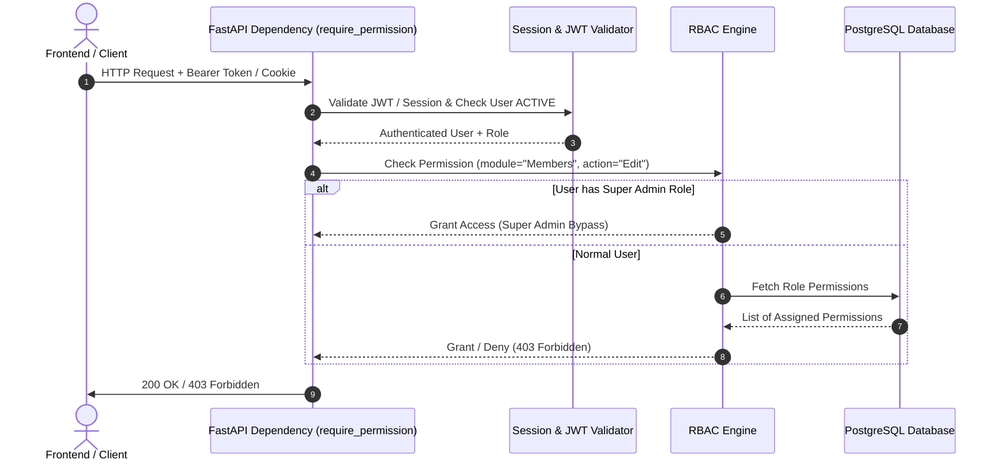

# Production RBAC & Permission Architecture

This document describes the unified Role-Based Access Control (RBAC) architecture powering the FastAPI backend and Next.js frontend.

---

## 1. Core Architecture Model

```text
┌────────────────────────────────────────────────────────┐
│                        User                            │
│  - id: UUID                                            │
│  - username: string                                    │
│  - roleId: FK -> Role.id                               │
│  - status: "ACTIVE" | "INACTIVE"                       │
└──────────────────────────┬─────────────────────────────┘
                           │ 1 (Role Assignment)
                           ▼
┌────────────────────────────────────────────────────────┐
│                        Role                            │
│  - id: UUID                                            │
│  - name: string ("Super Admin", "Manager", etc.)       │
│  - description: string                                 │
└──────────────────────────┬─────────────────────────────┘
                           │ N (RolePermission M:N)
                           ▼
┌────────────────────────────────────────────────────────┐
│                     Permission                         │
│  - id: UUID                                            │
│  - module: string ("Members", "Loans", "Groups")       │
│  - action: string ("View", "Add", "Edit", "Delete")    │
│  - code: string ("members:view", "loans:manage")       │
└────────────────────────────────────────────────────────┘
```

---

## 2. Permission Representation & Normalization

1. **Format**: Every permission is represented by a pair `(Module, Action)` or a standardized colon-separated string `Module:Action` / `module:action`.
2. **Machine-Readable & Language Independent**:
   - Permission validation checks **never** evaluate translated Bangla/English UI labels.
   - Comparisons are case-insensitive and whitespace-stripped.
3. **Action Synonyms & Hierarchical Resolution**:
   - `"Add"` $\leftrightarrow$ `"Create"` (Interchangeable).
   - `"Manage"` $\to$ Grants all actions within that specific module (`View`, `Add`, `Edit`, `Delete`, `Approve`, etc.).
   - `"*"` $\to$ Wildcard granting access across all actions and all modules.

---

## 3. Super Admin Behavior

- **Hardcoded Bypass**: Any user assigned to a role matching Super Admin variants (`"Super Admin"`, `"superadmin"`, `"adminsuper"`, `"SUPER_ADMIN"`) bypasses all permission checks automatically and unconditionally.
- **De-escalation Protection**:
  - The Super Admin system role cannot be renamed or deleted via API.
  - Deleting or modifying Super Admin privileges will raise `400 Bad Request`.

---

## 4. Backend Authorization Flow



---

## 5. Standard System Modules & Permissions Mapping

| Module | Available Actions | Standard Code | English Display | Bangla Display |
| :--- | :--- | :--- | :--- | :--- |
| **Dashboard** | `View` | `dashboard:view` | View Dashboard | ড্যাশবোর্ড দেখা |
| **Members** | `View`, `Add`, `Edit`, `Delete`, `Manage` | `members:view`, `members:add`, `members:edit`, `members:delete`, `members:manage` | View / Add / Edit / Delete Members | সদস্য তালিকা দেখা / তৈরি / সম্পাদনা |
| **Member Requests** | `View`, `Approve`, `Reject` | `member_requests:view`, `member_requests:approve`, `member_requests:reject` | Review & Approve Applications | সদস্য আবেদন পর্যালোচনা ও অনুমোদন |
| **Groups** | `View`, `Add`, `Edit`, `Manage` | `groups:view`, `groups:add`, `groups:edit`, `groups:manage` | Manage Village Groups | গ্রুপ / গ্রাম ব্যবস্থাপনা |
| **Funds** | `View`, `Add`, `Edit` | `funds:view`, `funds:add`, `funds:edit` | Manage Dedicated Funds | তহবিল ব্যবস্থাপনা |
| **Donors / Sadaqah** | `View`, `Add`, `Edit`, `Delete`, `Receive Installment` | `donors:view`, `donors:add`, `donors:receive` | Receive & Track Sadaqah | দাতা ও সাদাকা গ্রহণ |
| **Fund Collection** | `View`, `Add`, `Edit` | `fund_collection:view`, `fund_collection:add` | Monthly Dues Collection | মাসিক চাঁদা ও অনুদান সংগ্রহ |
| **Financial Support** | `View`, `Add` | `financial_support:view`, `financial_support:add` | Financial Assistance & Activities | আর্থিক সহায়তা ও তহবিল কার্যক্রম |
| **Beneficiaries** | `View`, `Add`, `Edit` | `beneficiaries:view`, `beneficiaries:add`, `beneficiaries:edit` | Manage Assistance Beneficiaries | সুবিধাভোগী ব্যবস্থাপনা |
| **Loans (Qard-e-Hasana)**| `View`, `Add`, `Edit`, `Manage`, `Approve` | `loans:view`, `loans:add`, `loans:manage`, `loans:approve` | Qard-e-Hasana & Repayment | কর্জে হাসানা প্রদান ও কিস্তি আদায় |
| **Reports** | `View`, `Export` | `reports:view`, `reports:export` | Financial Reports & Export | আর্থিক প্রতিবেদন ও রপ্তানি |
| **Users** | `View`, `Add`, `Edit`, `Delete` | `users:view`, `users:add`, `users:edit`, `users:delete` | User Administration | ব্যবহারকারী ব্যবস্থাপনা |
| **Roles & Permissions** | `View`, `Add`, `Edit`, `Delete`, `Manage` | `roles:view`, `roles:add`, `roles:edit`, `roles:delete`, `roles:manage` | RBAC Role Management | রোল ও পারমিশন ব্যবস্থাপনা |
| **Settings** | `View`, `Manage` | `settings:view`, `settings:manage` | System Configuration | সিস্টেম সেটিংস |
| **Audit Logs** | `View` | `audit_logs:view` | View Audit Trail | অডিট লগ দেখা |

---

## 6. Migration & Safe Compatibility Strategy

1. **Dual-Compatible Matching**: The RBAC engine in FastAPI recognizes both the Next.js `hasPermission("Members", "View")` syntax and the standardized `members.view` / `members:view` syntax.
2. **Zero Breaking Changes**: Existing database roles (`Super Admin`, `Manager`, `Employee`, etc.) and role-permission junction rows remain intact.
3. **Database Integrity**: The `Permission` and `RolePermission` tables are preserved in PostgreSQL with foreign keys and unique constraints.
